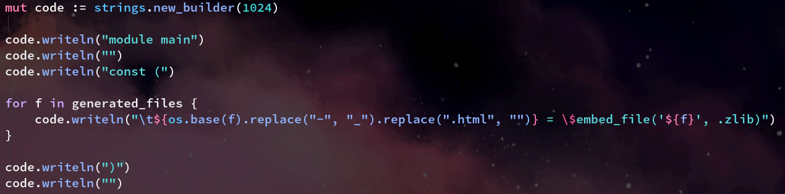

# How I write and publish blogs
The following post will attempt to go through the step by step process which I take when I would like to author and publish new blogs to this website.

### Obsidian
The blogs themselves are written using Markdown (if you don't know what Markdown (`.md`) files are somehow, you can read more about them [here](https://www.markdownguide.org/)). Obsidian is, amongst other things, great as a Markdown editor. It has native support for VIM bindings, and provides immediate feedback by rendering the document as you work on it.

I already use Obsidian as my "second brain" day to day to collect notes, snippets/quotes from other media and works, and so I can also take advantage of all of the plugins I already use to do stuff, including planning blog posts in advance using "daily notes".

Obsidian also renders externally referenced assets such as images in place, which is very useful. When I open Obsidian to edit the blogs, I open the directory `./site/blogs` as the "vault" to use. Within this directory are all of the Markdown files which each represent an individual blog post, and another sub directory `static`, which is where all images and other referenced assets live.

As the below screenshot shows, I have set up Obsidian (for this vault, settings are stored per vault which is also very useful) to always place new assets which are "pasted" into the document in this location, and reference them using a relative path, such as ``, which comes in handy later on as we will see.

### Attachment file names
There is a slight caveat to this system, in that at this point of the blog authoring process it makes no difference, but I do have to make sure the names of these are all lowercased and delimited by `-` rather than whitespace. Something like `Screenshot 2023-09-26 at 10.52.39` for example is not going to work later on.

## Compiling/building
Once a blog post has been created, edited etc., the next step is to run `just compile-blogs`. This is a `justfile` command which runs this: `v run compile_blogs.v` in the root of the website repository. `compile_blogs.v` is a discrete V program which is responsible for parsing all existing markdown files within the `./blogs` directory and generating required output.

The next step is to run `just compile`, which invokes this command: `v ./src -o website.bin -prod`. This is an instruction to the V compiler to produce a production release version build of the website. Pretty much all of the website contents, including CSS, HTML, custom fonts etc., are all packed, or "embedded" into this binary. The only resources which are not are the images referenced by blog posts, they are served from the server.

## Deploying
This website is currently deployed on a VPS server running Debian Linux. Deploying new changes to the server is pretty straightforward:
1. Using SCP the binary is transferred to the server's home directory
2. Similarly SCP is then used to copy the whole contents of the `./blog/static` directory to one of the same name on the server (this contains all of the blogs image assets)
3. SSH into the server, and attach to the running tmux session with `tmux a`
4. Open a secondary split below the single running pane which is attached to the server process
5. Kill the running server process in the first split with `<C>-c`, and very quickly remove the old build from the deployment directory, and copy the new one into its place using the second tmux split.
6. Swap back to the first tmux split, press up to resolve the run command, and hit return
7. Detach from the tmux session using `<C>-b d` and exist out of the SSH connection

## The code
This is the entry point function to `compile_blogs.v`:

You can see here that the first function invoked is called `compile_markdown_blogs_into_html_files`. Happily the function name is very clear and self documenting, but we might as well take a look to see what it is doing.

### Step 1a.

The first few lines are ensuring that the directory which we want to read from (the blog Markdown files directory), and the directory which we would like to write to both exist already. I could just create them if they do not exist, but for now I'd rather now. I don't really know why exactly, but I think it's because they shouldn't ever not be there anyways, and if they are indeed missing, something else is probably wrong.
### Step 1b.
Then this: `os.walk("./src/blog", fn (path string) { os.rm(path) or { ... } })` ensures that the target directory is empty. When we run this compile process, each blog is "rebuilt" each time, even if no changes have occurred. We could do better, but for now there's so little blog posts that there's no good reason to spend time optimising/making stuff more complicated for very little gain.
### Step 2.

Next up, for every file which exists with an extension of `.md` within the blogs directory, we create and write to a new file with the same name, but one which has a `.html` extension. We then immediately write the previously extracted header template (which is shared across all site pages) to this file.

### Step 3.

The rest of this function is then an iteration over each line of the current Markdown file we are working on. First we allocate a list of bytes 1024 (or 1kb) in size called `buffer`. We then call the V std library method on our open file descriptor to read as many bytes as available into our buffer.

#### What does `read_bytes_into_newline` mean/do?
If we check the V std lib documentation for this method, we find the following:

The last line (which incidentally seems to be incorrectly worded) is of most interest in the case of the above code. What it means is simply that the function will return if:
1. The buffer is filled up before a newline is encountered
2. A newline is encountered
3. The file's EOF is reached

That's the reason for the following branches, after we invoke this read method:

#### Branch 1.
`if read_bytes == 1024 {`
`        input_line := buffer.bytestr()`
`        output_line := markdown.to_html(input_line)`
`        wfd.write_string(output_line) or { println("unable to write to file: ${target}"); return }`
`        return`
`}`

and

#### Branch 2.
`if read_bytes < 1024 {`
`    mut output_line := " "`
`    if read_bytes > 1 {`
`    input_line := buffer[..read_bytes - 1].bytestr()`
`    output_line = markdown.to_html(input_line)`
`}`
`wfd.writeln(output_line) or { println("unable to write to file: ${target}"); return }`
`}`

For branch 1. it basically takes the fact that the whole buffer was filled to mean that the line it just read has yet to finish, so it must be just a really long line. We don't really care, and we therefore just convert all of the line we've read so far into HTML from Markdown.

For branch 2. we didn't fill up the whole buffer before returning, and so we must have encountered a newline (or EOF). In this situation, we want to check if the line is more than one character long, if it is we convert this line, excluding it's newline (we assume it has one, as of yet we're not handling the EOF case! 😮) If the line is only one character long, we assume it's a newline character on its own, and we convert that into padding.

#### Finally
The final line at the end of this function just writes the previously read HTML footer to the end of the new HTML file.

### The attachment caveat
I mentioned earlier that images needed to be lower-cased and delimited by `-` instead of spaces. That is because when the Markdown to HTML converter we need the resulting conversion to be a valid URL. The Markdown converter does not concern itself with doing escaping of illegal characters, so for our purposes it is just simpler to name these files with already valid/legal characters.

### Embedding
We're not done yet. The second function invoked in `main` is `generate_blog_embeds_code`.

### Step 1. Acquire blog HTML files list

The first thing this function does is build a list of the all the just created HTML versions of all the blog posts. It could be derived perhaps from the generation function, but for now this will do.

### Step 2. Generate embed directive line per HTML file in list

Next we write to the strings builder for each discovered file some V code which when compiled as part of the main program/server/website app, will instruct the compiler to (at compile time) directly embed these files into the resulting output binary.

### Step 3. Generate function to return list of blogs

Generating another function which contains a human readable list is useful for the website to be able to present this to the user on the blog homepage/index page.

### Step 4.

Finally we generate _another_ function, this one is probably the most important one, in that it's called from the blog view handler to resolve the request blog with the contents of the embedded file data, which is then returned back to the user.

## Conclusion
This was hopefully a clear and interesting overview of exactly how I decided to solve this "problem" of being able to produce an entire website and most of it's required assets as a single distributable binary with no front end framework, or annoying restrictive runtime required.

There are some things which need work. For example, when converting the Markdown to HTML, there's a problem with multiple lined code blocks, stemming from the fact that we only feed the data to be converted line by line, and so when the converter encounters an open code block signifier, it doesn't know to not treat all the lines of code in-between this and the close code block.

I will have to consider maybe it is worth just passing the entire file into the converter in one go rather than line by line, even though doing this feels kind of nasty to me.

Anyway, I hope this was useful/interesting/of note/whatever. Thanks for reading!

⣿⣿⣿⠟⠛⠛⠻⣿⣿⣿⣿⣿⣿⣿⣿⣿⣿⡟⢋⣩⣉⢻
⣿⣿⣿⠀⣿⣶⣕⣈⠹⠿⠿⠿⠿⠟⠛⣛⢋⣰⠣⣿⣿⠀⣿
⣿⣿⣿⡀⣿⣿⣿⣧⢻⣿⣶⣷⣿⣿⣿⣿⣿⣿⠿⠶⡝⠀⣿
⣿⣿⣿⣷⠘⣿⣿⣿⢏⣿⣿⣋⣀⣈⣻⣿⣿⣷⣤⣤⣿⡐⢿
⣿⣿⣿⣿⣆⢩⣝⣫⣾⣿⣿⣿⣿⡟⠿⠿⠦⠀⠸⠿⣻⣿⡄⢻
⣿⣿⣿⣿⣿⡄⢻⣿⣿⣿⣿⣿⣿⣿⣿⣶⣶⣾⣿⣿⣿⣿⠇⣼
⣿⣿⣿⣿⣿⣿⡄⢿⣿⣿⣿⣿⣿⣿⣿⣿⣿⣿⣿⣿⣿⡟⣰
⣿⣿⣿⣿⣿⣿⠇⣼⣿⣿⣿⣿⣿⣿⣿⣿⣿⣿⣿⣿⣿⢀⣿
⣿⣿⣿⣿⣿⠏⢰⣿⣿⣿⣿⣿⣿⣿⣿⣿⣿⣿⣿⣿⣿⢸⣿
⣿⣿⣿⣿⠟⣰⣿⣿⣿⣿⣿⣿⣿⣿⣿⣿⣿⣿⣿⣿⣿⠀⣿
⣿⣿⣿⠋⣴⣿⣿⣿⣿⣿⣿⣿⣿⣿⣿⣿⣿⣿⣿⣿⣿⡄⣿
⣿⣿⠋⣼⣿⣿⣿⣿⣿⣿⣿⣿⣿⣿⣿⣿⣿⣿⣿⣿⣿⡇⢸
⣿⠏⣼⣿⣿⣿⣿⣿⣿⣿⣿

